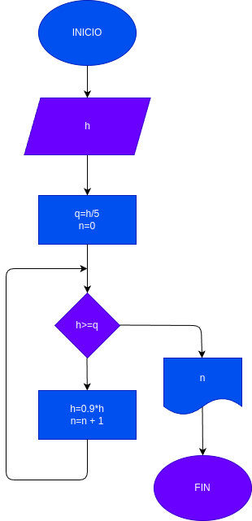

# Calcular_altura_h
Programa para calcular el rebote en el que un pelotano alcanza la quinta parte de la altura h si en cada rebote sube un 10% menos.

# Analisis 
## Input
### Variables de entrada
h,n,q

### Processing
h=h*0.9
n=0
q=h/5
### output
n
# Diseño

# Construccion